源自侯捷老师STL课程！

# STL Application

## componets

此处与OO不同，数据在容器，操作在算法，迭代器将容器与算法连接，分配器为容器分配内存。

仿函数模拟一些操作，算法是一些通用操作？

适配器主要用于容器相关转换？

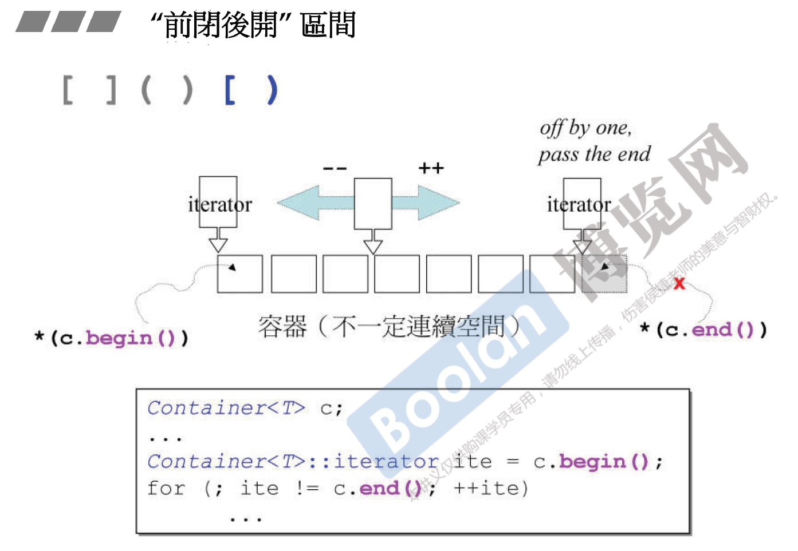

iterator迭代器，左闭右开区间。

## container

array定义需要带大小，array是在堆还是在栈？

可以分析find和sort+bsearch时间消耗，find最差O(n)，sort快排O(nlogn)，所以find遍历更快，后续分析也可以得出，此处运气好时间ns级别。

sort()函数，forward_list、list中自带。自带的函数一定是最优的，算法sort针对的是支持随机访问的iterator。

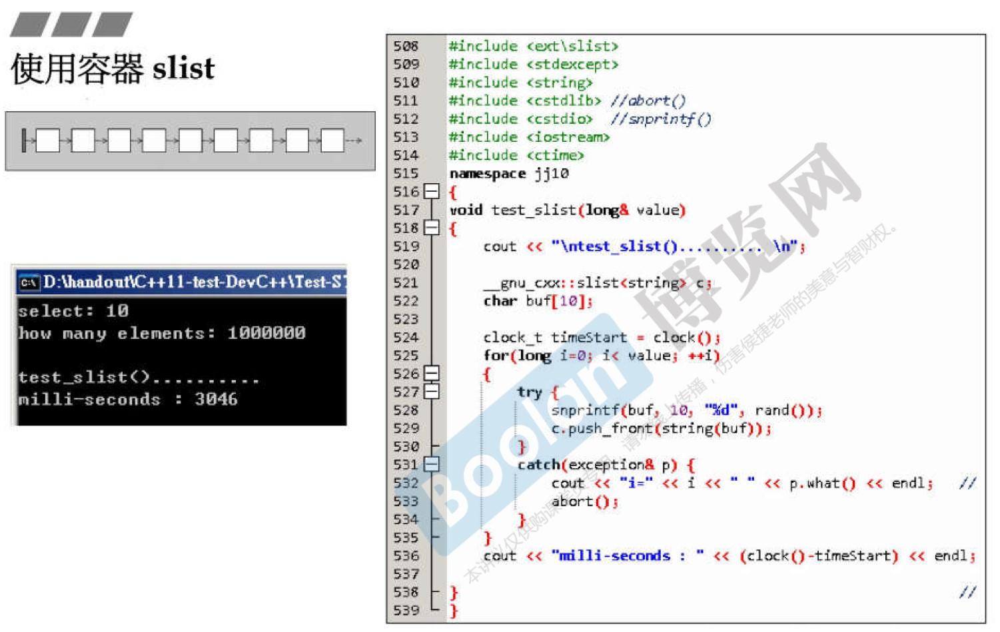

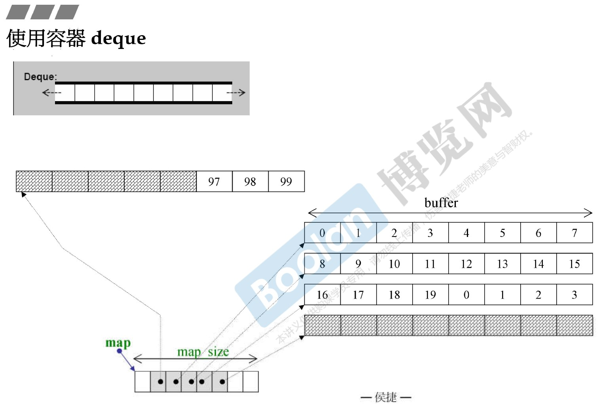

deque结构为map+vector！其中封装边界处理。

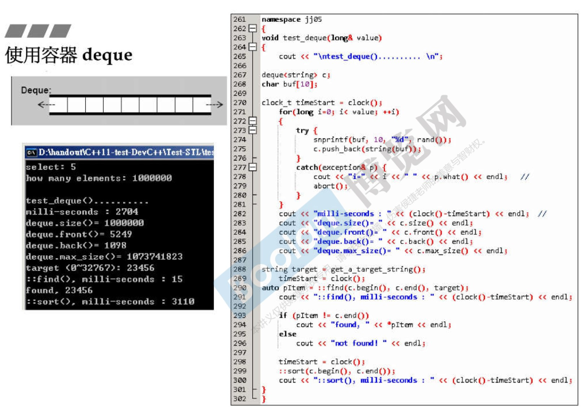

stack是deque的魔改。

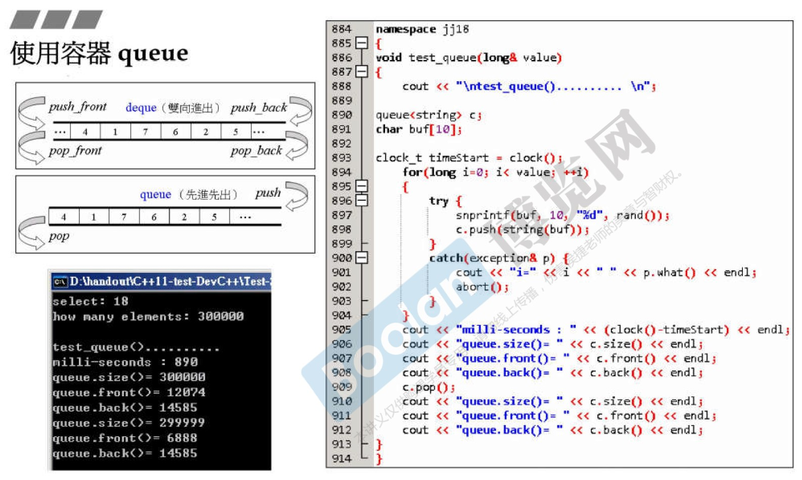

queue是deque的魔改。

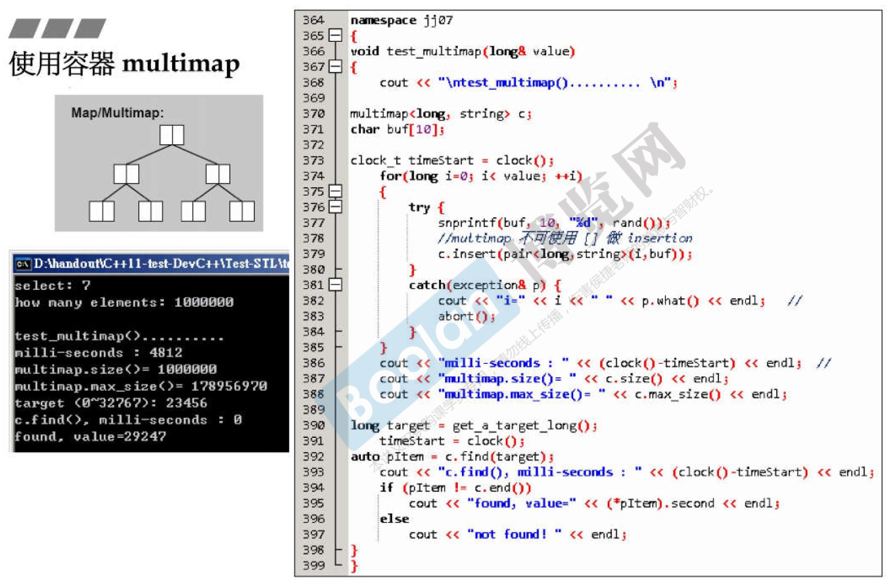

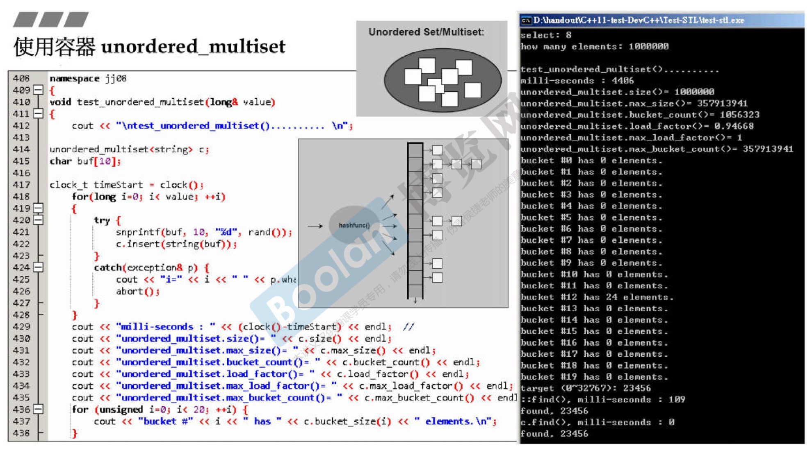

unordered容器底层即hashtable，此处拉链hashtable中桶数量必须比元素多。

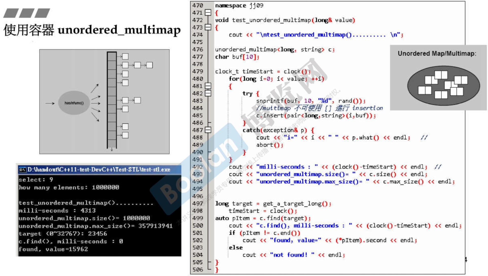

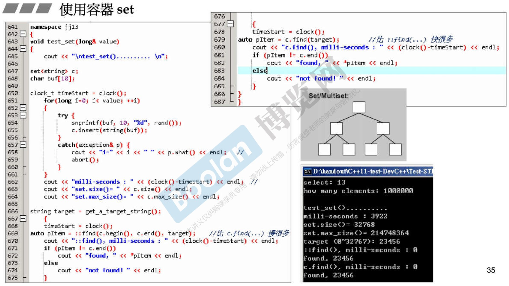

- 容器成员函数表：

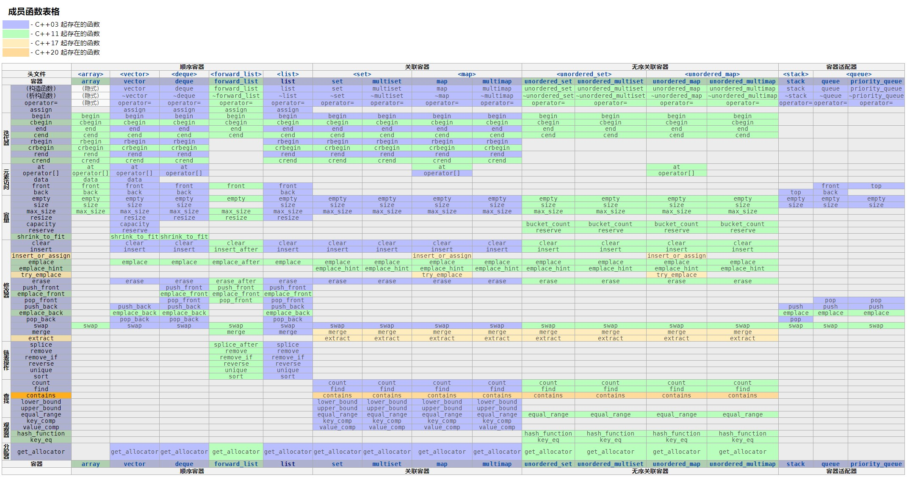

## allocator

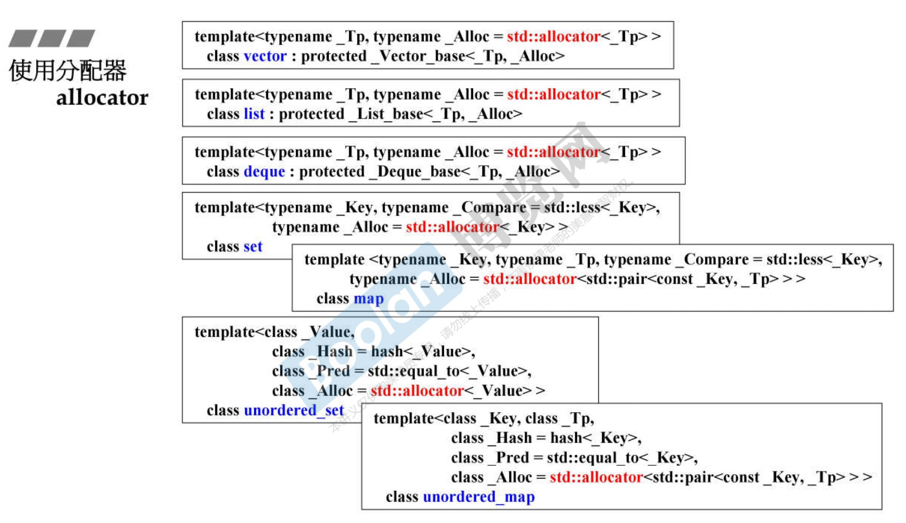

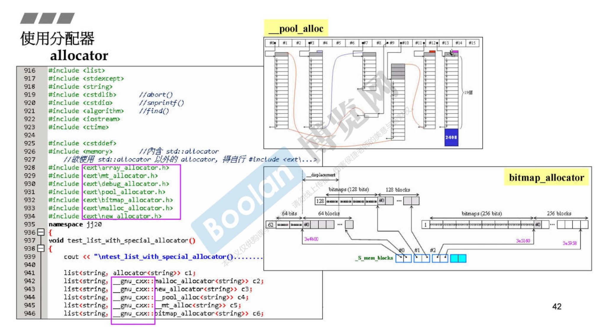

可以修改第二个参数更改allocator，默认为`std::allocator`。