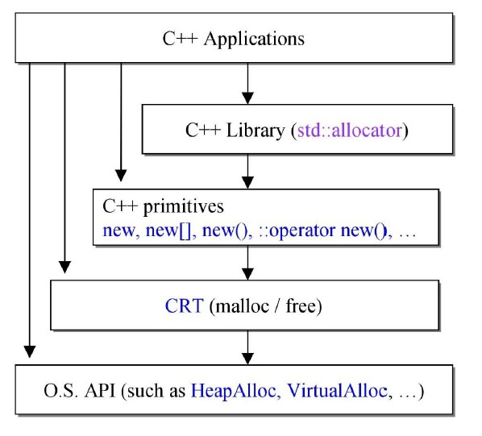
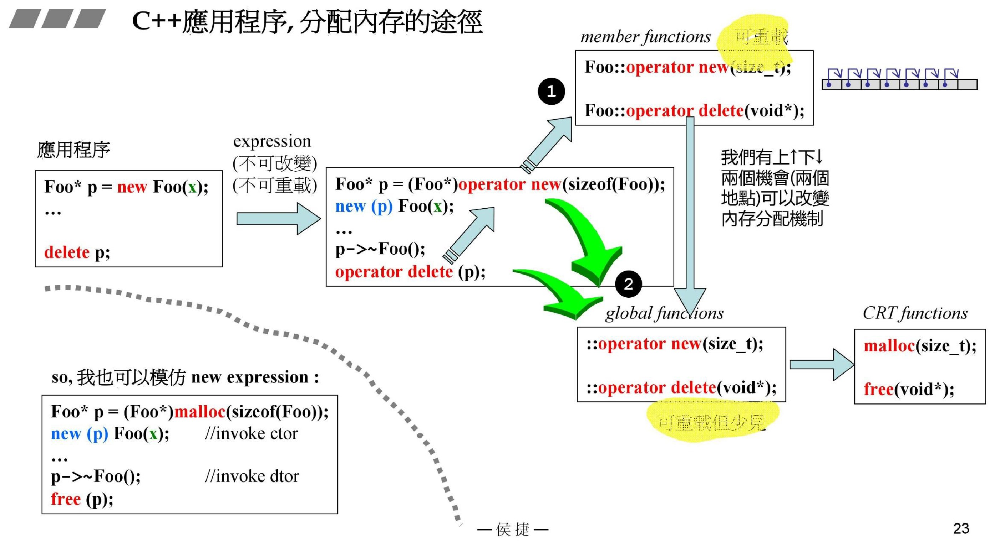

源自侯捷老师内存管理课程！

# c++程序，使用memory的途径

c++程序有四种方式使用内存：
    
1. c++ libarary（比如标准库）；
2. c++ primitives（new,new[],new(),::operator new(),...）；
3. CRT malloc/free；
4. OS API。

## new expression

new expression具体执行流程：

1. 首先调用`operator new()`，申请空间
2. 申请空间，再去调用malloc分配内存
3. 对申请的内存进行转换，以便初始化
4. 通过`placement new()`进行初始化

- 注：

    `placement new()`用于对已有空间进行初始化，而不申请空间，故没有配对的`placement delete`

delete expression流程：

1. 首先调用析构函数
2. 接着`operator delete`
3. 再调用free释放内存

## array new, array delete

此处不太寻常，进行`new[]`时，申请的空间带一块cookie。

`new[]`与`delete[]`应配对使用。若使用delete，由于底层调用的free，根据cookie可以正确释放new申请内存空间，但是无法释放构造函数中申请的别的内存空间。

让我们看看cookie，也就是`new[]`到底申请了一片什么空间？

对于内置基本类型，如下：

注意到申请的空间并不止40bytes！

再来看对于自定义类会怎样：

申请的空间为（32+4）+4+36+（4*2）=84->96bytes！

32+4为前后信息，4是数量标记，36为实际占用，4*2为前后信息，由于需要16倍数，故补齐到96bytes！

可以看出cookies占用了较大空间，所以我们需要自己重载new，来节省空间！

## placement new

`placement new`不分配内存空间，而是在已分配空间构建对象。

## c++ memory分配

如最开始所说，c++应用程序分配内存的方式可以由上往下一步一步调用：new/delete->operator new/delete()->局部/全局 oprator new/delete()->malloc/free;或者直接使用malloc/free。

另外一种是通过容器allocator，调用或使用内存池调用::operator new/delete()，再调用malloc/free进行分配。

# 内存管理的终极目的

1. 节省空间！见cookies
2. 提升速度！