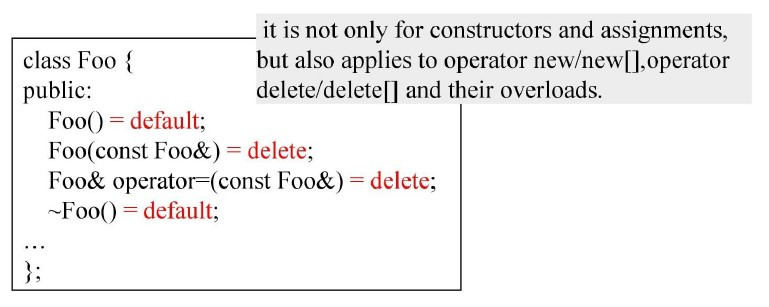
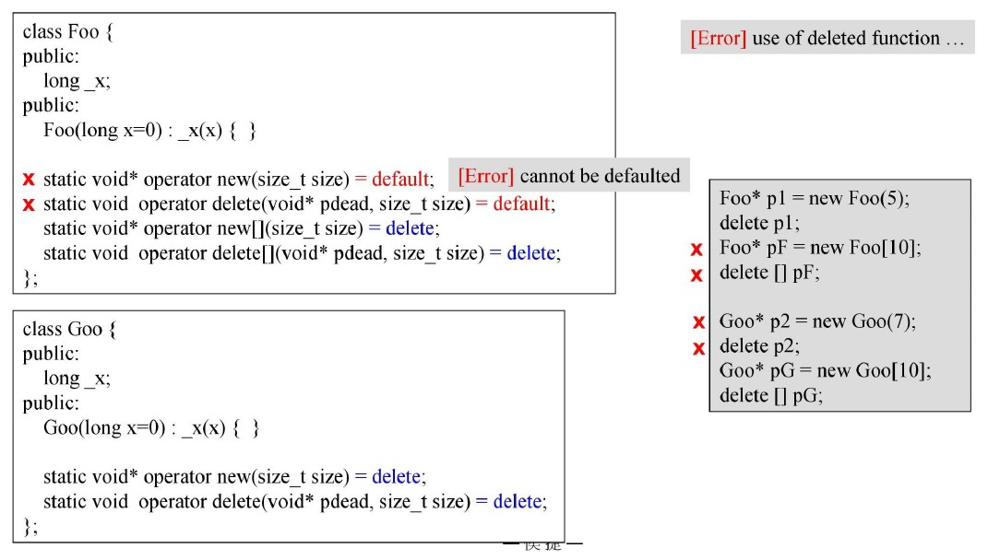
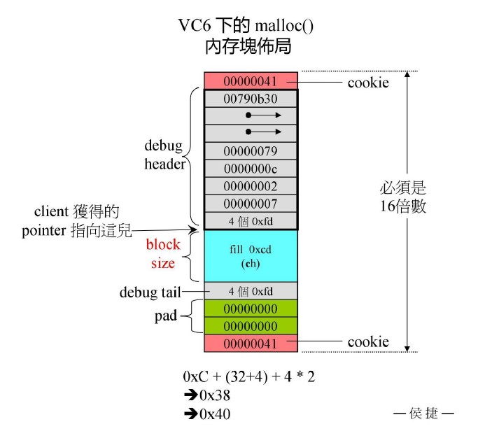

源自侯捷老师内存管理课程！

# handler

handler的作用就是在`operator new`分配空间失败的时候，解决问题的手段，会被循环调用，最后才会抛出std::bad_alloc异常。

handler常用手段：
1. 调整内存，重新分配内存空间
2. 打印错误，做错误处理，调用`abort()`或`exit()`

空handler会带来死循环，直至分配到内存为止！

## default & delete

并不只有默认构造函数、默认拷贝构造函数可以`=default`和`=delete`;
operator new/delete也可以。

实际测试发现，并不能`=default`，但可以`=delete`。

# allocator

## vc6 malloc()

allocator抽象出来就是为了减少malloc的cookie消耗，同时有一个先决假设：malloc效率低（实际并不是）。

前后红色的为cookie，中间为debug模块、pad填充模块和实际区块，共同组成16倍数的空间。
malloc在真正的区块周围进行封装都是为了方便free释放空间与其余一些操作，比如debug？

## vc6 std::allocator

观察代码可以发现，vc6的标准allocator使用的还是operator new/delete()。

## BC5 std::allocator

观察代码可以发现，BC5的标准allocator使用的也是operator new/delete()。

## GN2.9 std::allocator

观察代码可以发现，GN2.9的标准allocator使用的也是operator new/delete()。
但是有个注释，不建议使用标准的allocator，建议使用GN2.9带来的SGI allocator。

然而GN2.9的容器使用的不是标准的allocator，而是SGI allocator。

此处还有一点不同，分配空间时的方法用的是static的，而不是对象的方法调用。
`alloc::allocate(512)`对比前面的`allocator<int>().allocate(512)`。