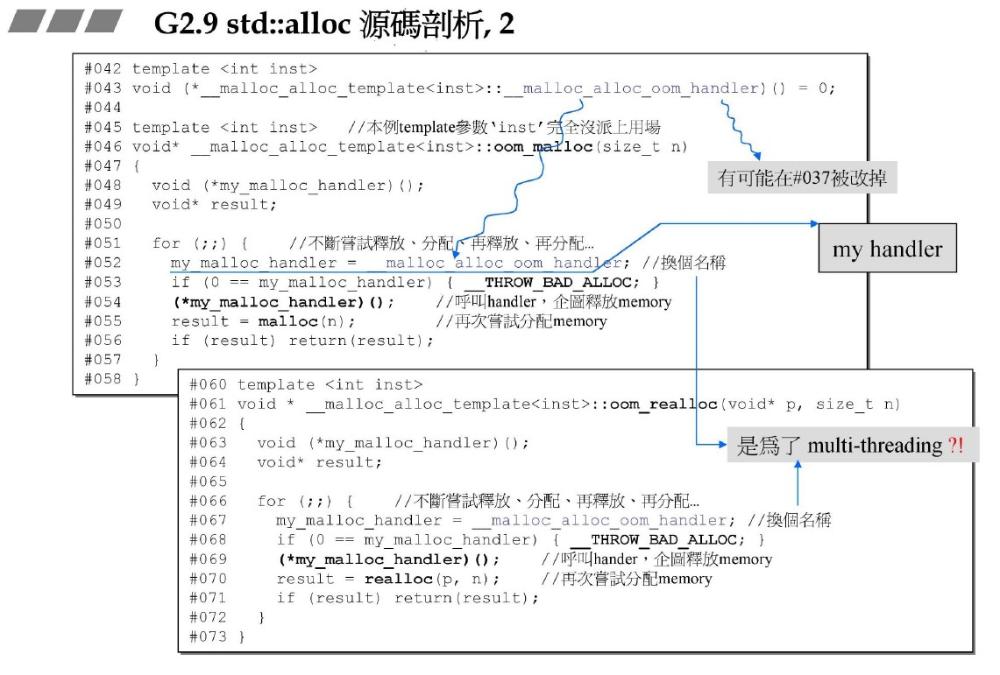
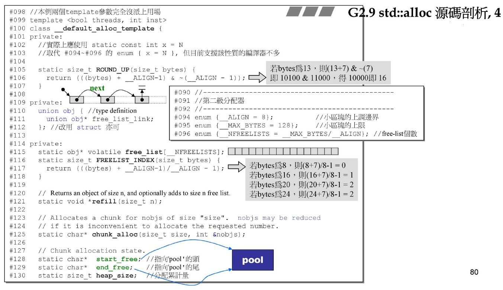
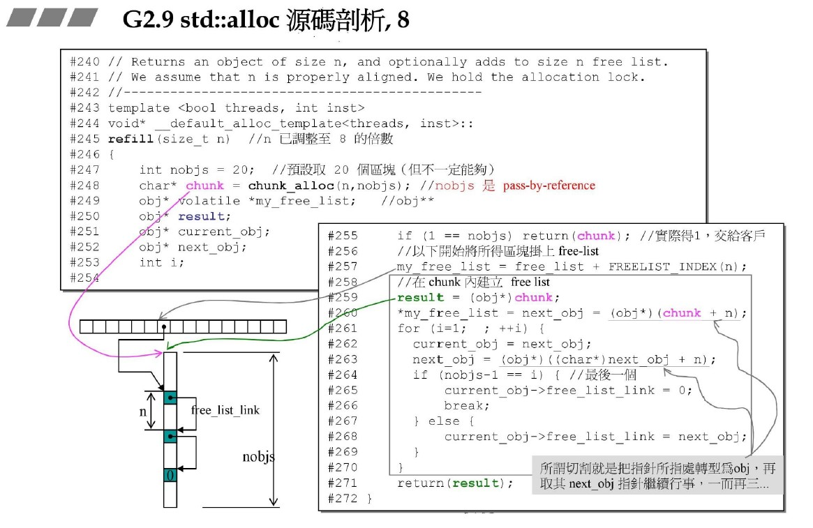

源自侯捷老师内存管理课程！

# GN2.9 std::alloc 

## 源码剖析

- 一级分配器：用于处理无法使用内存池分配空间的场景。

通过使用handler完成。

- 二级分配器：使用前一篇中的内存池思想进行分配。

**private:**

`ROUND_UP`：向上取16倍数。

`FREELIST_INDEX`：根据大小去到对应的内存池位置。

`refill`：申请空间。

`chunk_alloc`：对未分配空间做分配。

_ALIGN：小区块下界。

_ALIGN：小区块上界。

_NFREELISTS：内存池块类别大小，即free-list个数。

start_free：未分配空间头指针。

end_free：未分配空间尾指针。

heap_size：已申请空间大小。

**public:**

`allocate`：申请内存。

`deallocate`：释放内存。

- 问题：

    1. 释放的空间没有判断是否是内存池的。

        因为不是内存池的大小不是固定为8的倍数，会带来灾难后果。

    2. 没有free，释放的空间并没有真正退回，而是一直持有。

        会有浪费内存的现象！反而不如malloc带cookie？

分配的时候，将得到的块返回，将当前的free-list指针指向第一个空块。

回收的时候，结合上面的思想，将要回收的空间头插回free-list指针。

严格遵循流程：

1. 先去占备池里申请20个；
2. 不行，试着申请到最多个数；
3. 还不行，要申请新空间，同时将当前持有空间合理分配出去（根据比当前块小，为8倍数的特性，可以分配给前面的块，且只能有一块），在递归调用一下将申请到的空间分配出去。

对分配器变量做定义，同时顺手初始化，重在在定义！
代表指针空的0可以用c++11`nullptr`代替。
