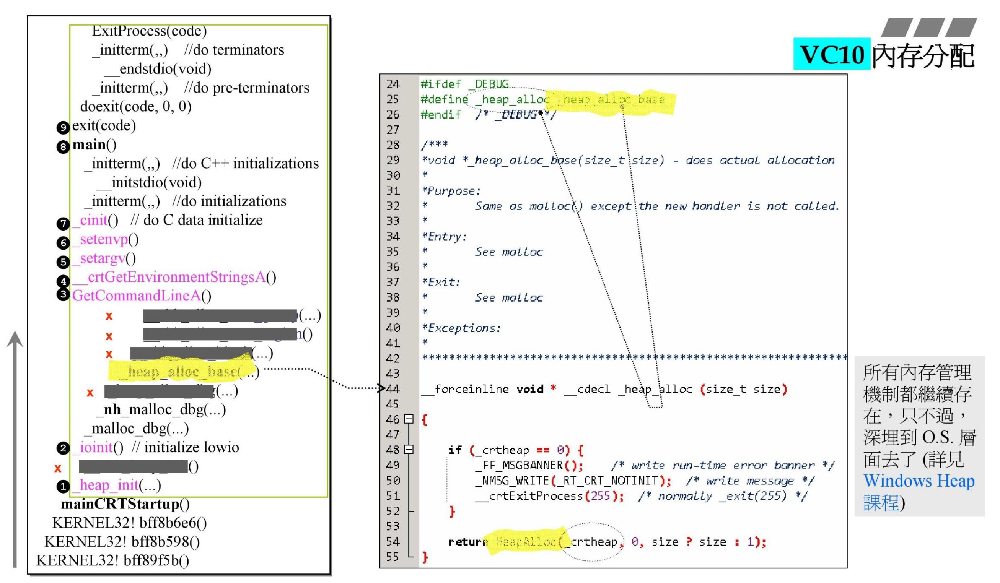
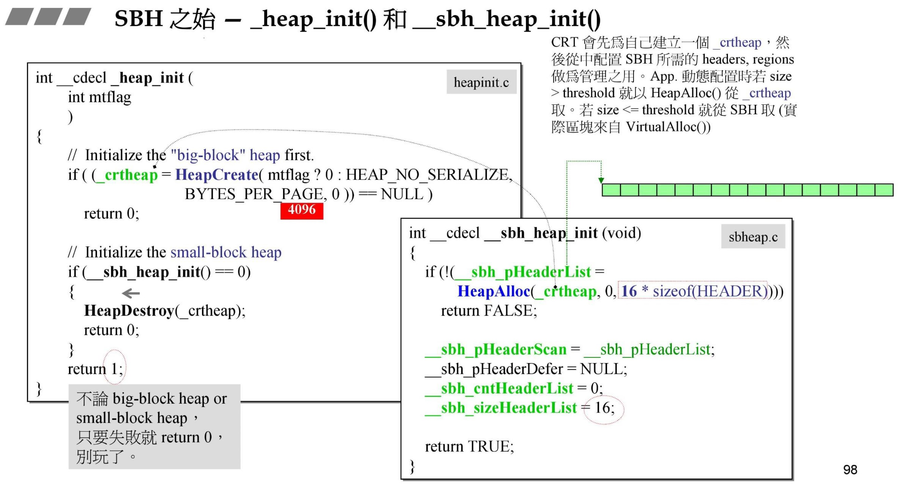
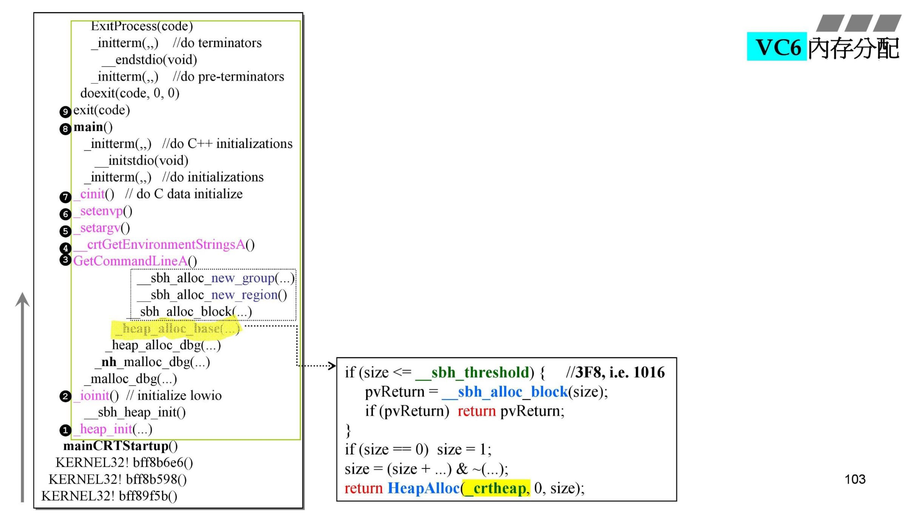
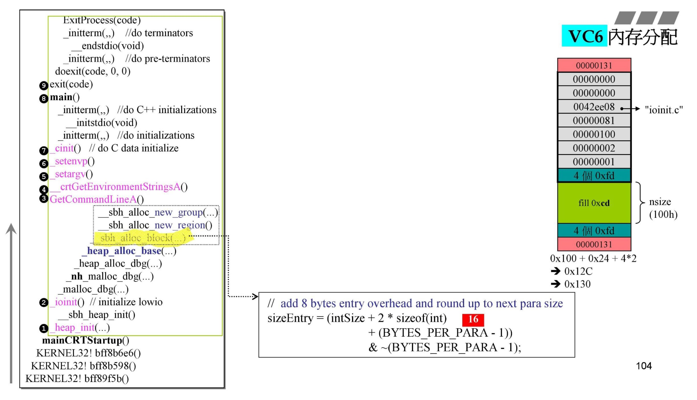
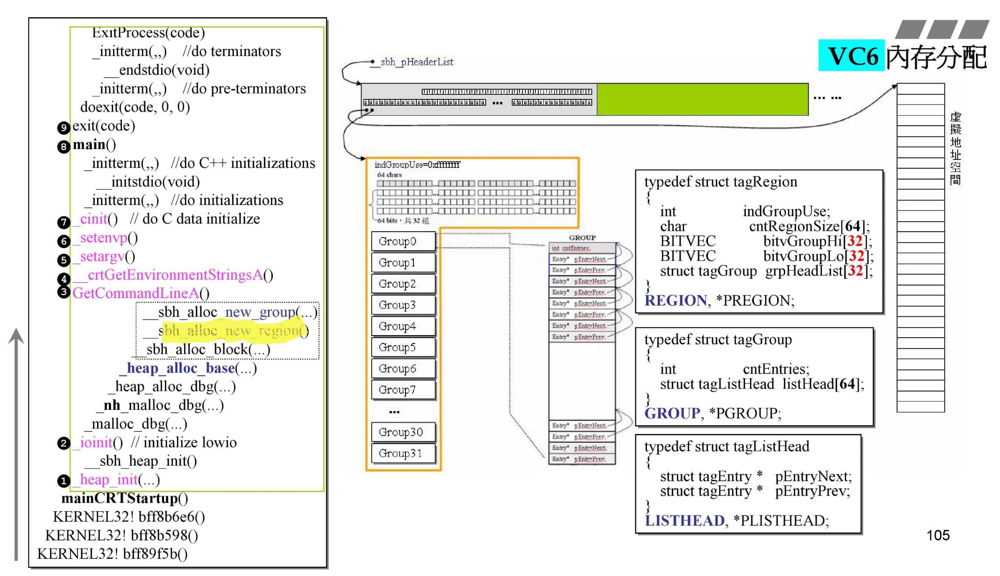
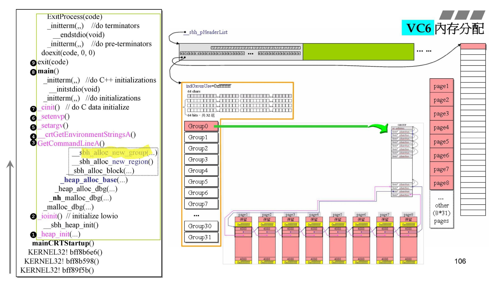
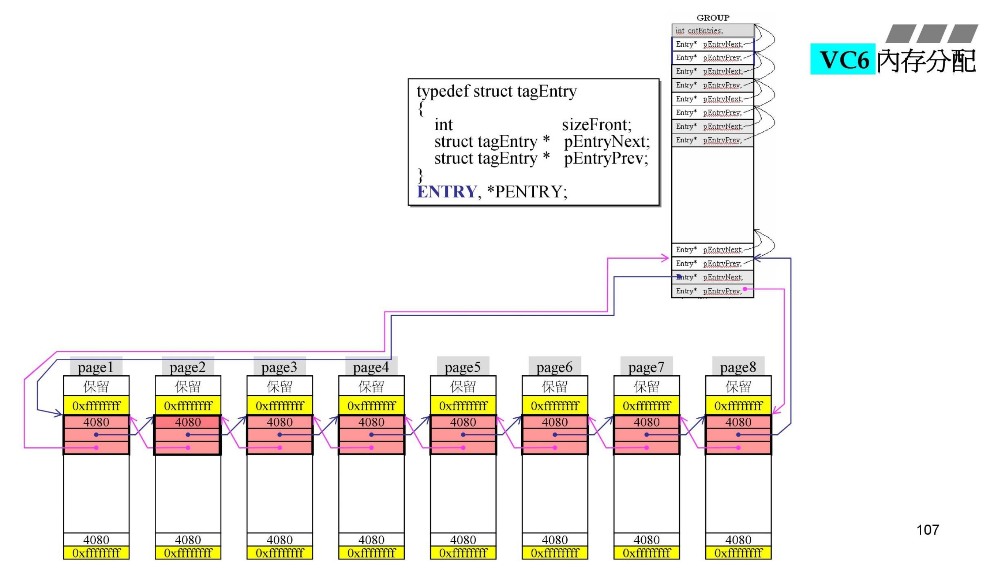
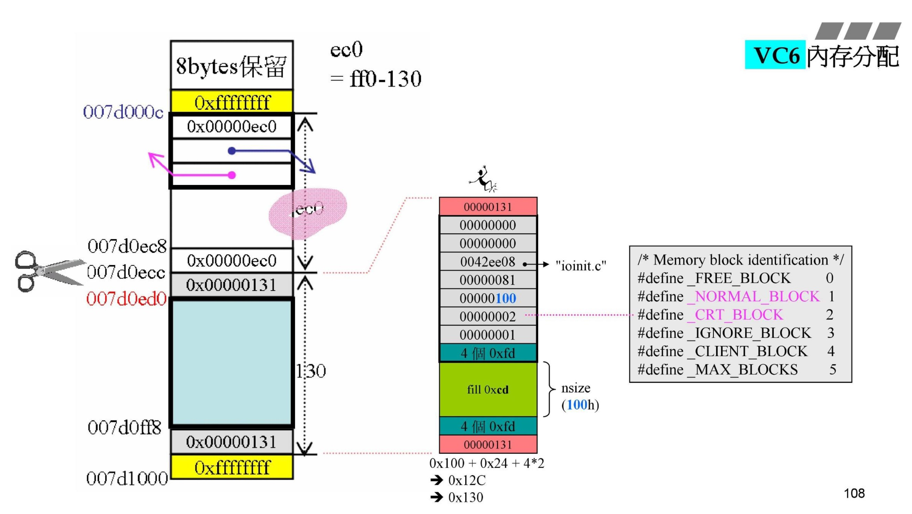

源自侯捷老师内存管理课程！

# vc malloc

## vc6与vc10对比

## vc6 malloc 分析

heap_init：从系统获取内存页（4k），供后续使用。

heap_init使用的header结构，16个，一个管理1MB空间。

- 问题：
  详细探索其中结构，总共16M？，32与64是管理啥的？

ioinit：初始化块中debug的部分！

ioinit中debug使用的debug header：

`CrtMemBlockHeader`--用于Debug的块结构，即为DEBUG header

1. 前向指针
2. 后向指针
3. 文件名
4. 行数
5. 块大小
6. 块使用类型标记，见本章最后一张图
7. 流水号
8. 前无人区
   
后续结构：

9.  数据块
10.  后无人区

前后无人区用于保护真正的数据块，调试的时候方便检测出使用越界！

上下红色为cookie。

heap alloc：根据申请的空间分配内存。

比1016而不比1024是因为还有8为cookie留的！

sbh alloc block：分配的块结构。

ROUNDUP(块大小+cookie)，向上取到16的倍数！

cookie中的内容借用最后一位的0、1表示该块是否分配！

一个header可以管理1MB空间，成本约为16KB。

region是header中的管理结构：

`tagRegion`

BITVEC 共同组成一个32*64的位图，表示是否被使用。

`tagGroup`

管理实体，64组。

`tagListHead`

实体为list结构，需要前后指针。

page中黄色区域两个-1用作回收空间时的上下篱笆（类似cookie作用），保证回收至原先的每页4K，不在往上合并。

group是虚拟存储空间:

一个group对应8个page。

`tagEntry`

一个整数，两个指针。

此处利用了结构体三个元素都一样大特点，往前三格，实现了双向循环链表，从而节省了那个整数对内存空间的使用。炫技？

此处块使用类型中，NORMAL_BLOCK若在程序运行最后还有就是内存泄露，大概gdb就是这样来检测的吧。
