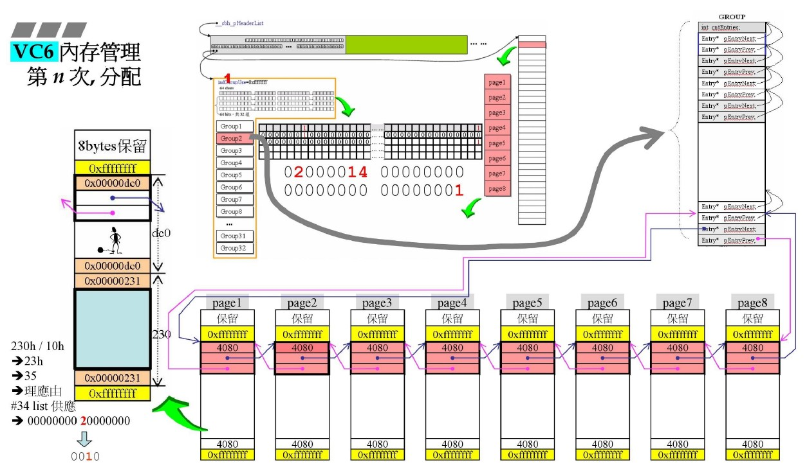
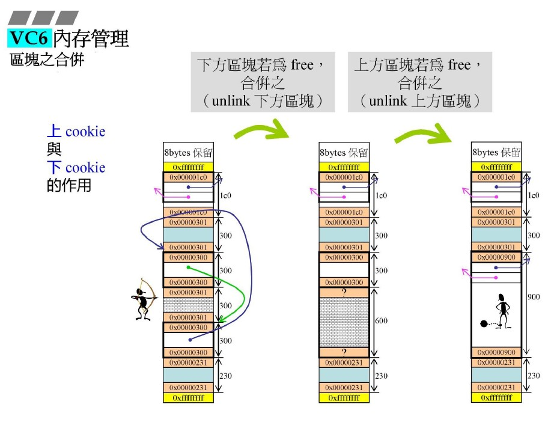
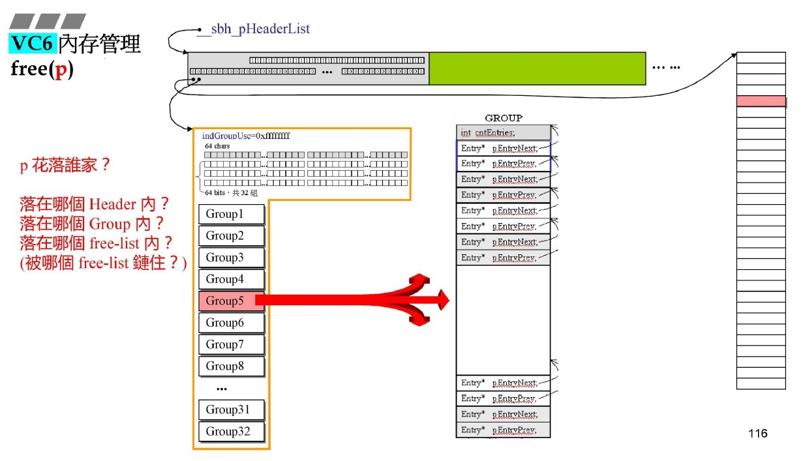
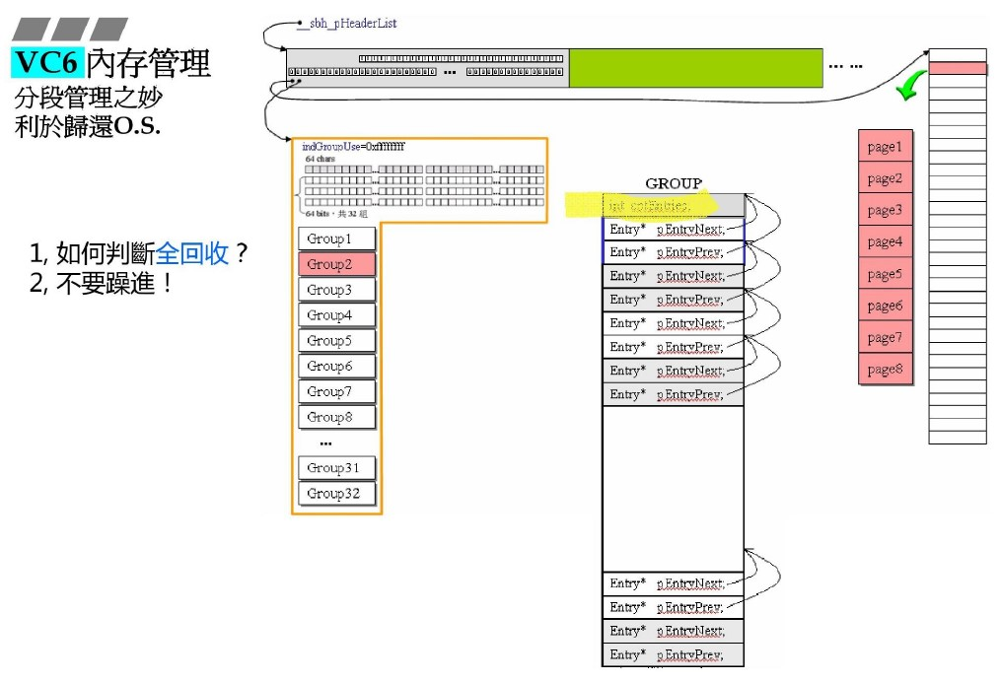
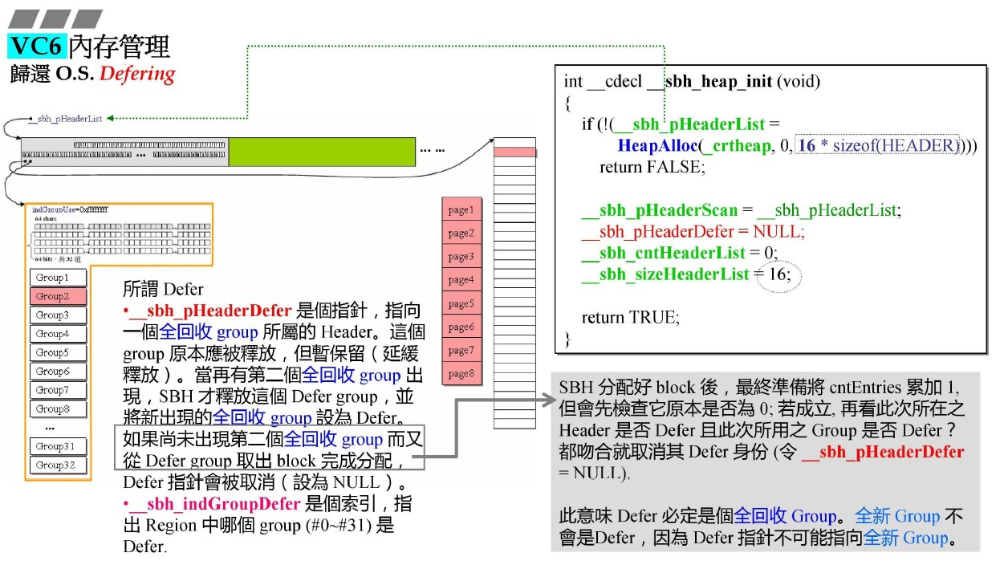
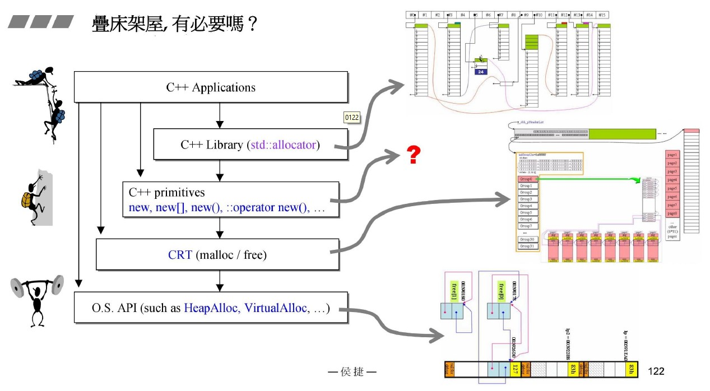

源自侯捷老师内存管理课程！

# vc6 memory alloc

## alloc

首次分配初始化流程：

1. HeapAlloc：堆分配，初始化16个header；
2. VirtualAlloc：对header做内存分配，占据1MB内存；
3. HeapAlloc：初始化header管理的Region和Groups；
4. VirtualAlloc：从1MB中分配32K（8个4K页）。
5. 然后将申请到的32K挂到Group1的最后一个Entry上，同步更新Region的bitmap中的最高位为1，表示最后一个实体上有待分配内存。

分配流程：

1. 从待分配中切割出需要的大小，根据需要大小计算（就是16倍数向上取整，同之前的allocator），再结合位图查找出比其大的第一个待分配块；
2. 块中剩余空间挂载到对应的实体上，计算方式为空间大小/16，修改对应的位图位置为1。

- 隐藏细节：
  
正常分配的空间带Debug header，其中前两者为指针，此处的指针同嵌入式指针，尽在为使用的空间存在，使用的空间会被对应内容覆盖。

cntEntries++!

回收流程：将块挂载到对应Entry，计算方式同上，修改对应位图位置为1。

- 隐藏细节：

为什么直接挂载过去，不用担心有多个吗？因为会有合并操作！见下面合并。

cntEntries--!

合并流程：

1. 根据指针-4B，回到前cookie位置，加上cookie中的块大小，得到下一块的起始位置，即cookie位置；
2. 查看对应cookie的最后一位，是0，执行向后合并；
3. 再根据指针-4B，回到当前cookie位置，再-4B，得到上一块的尾cookie位置；
4. 查看对应cookie的最后一位，是0，执行向前合并。

- cookie的作用：

如同篱笆一样，鲜明的切割出每一块的前后，方便debug检测越界；但是最重要的原因是方便malloc中回收内存、避免内存碎片。

## free

释放流程：

1. 根据p的位置可以计算出其属于哪个Header，通过p-header的pHeapData<1B判断；
2. 根据p的位置计算其属于那个Group:（p-pHeapData）/32KB; 
3. 根据p计算出其属于哪个Entry（free-list）：p-pHeapData-groupNum*32KB/16B。

得到最终位置，进行释放。

- 为什么不根据p指针直接释放而要层层计算呢?

因为p的空间是通过一堆数据结构来管理，释放的时候需要对其进行操作。而不像allocator直接回收头插回取就可以了。

全回收判断：cntEntry的作用来了！cntEntry为0，表示没有分配的实体，直接全回收了！此时可以归还给操作系统了吗？

显然不可以有全回收就归还，因为无法保证全回收之后的操作不是分配空间！

采取的回收策略是延迟回收，使用Defer指针指向当前持有的全回收空间GroupNum，若当前持有，释放持有的，将当前全回收空间挂上去。

全回收必然是cntEntries为0，只有最后一个Entry上挂这8个4KB页，即最初的场景。

## 总结

充分利用了段页式的思想管理内存，采用header-region-group-entry/freelist的结构，结合位图思想。其中穿插嵌入式指针的思想，union最大化空间复用。增加cookie作为篱笆清楚划分每个区块，综合cntEntries，及时将不使用的空间还给os。

## analyz

为什么需要在每一层都做一个内存管理系统呢？

为了独立性，不过于依赖下一层，万一其不提供带来的性能损失，通过冗余保证效率。
allocator再alloc上面封装是为了减少cookie的内存占用。
malloc是为了支持多种系统（但是不用的系统内存管理的系统调用不同，还是依赖，只是不依赖其做内存池）。

vc10中的malloc不做内存池了，因为其自身开发windows，底层有完善的支持。现代操作系统大多支持，我们不需要手动实现了。