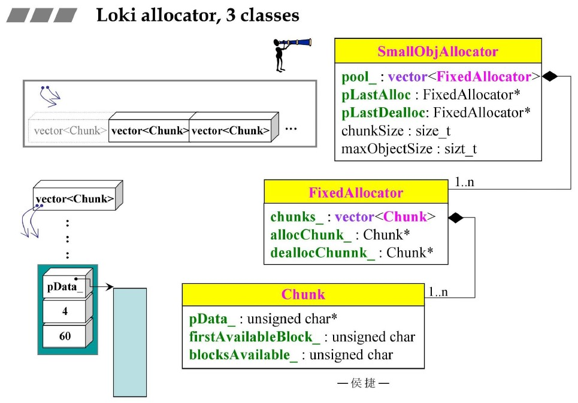
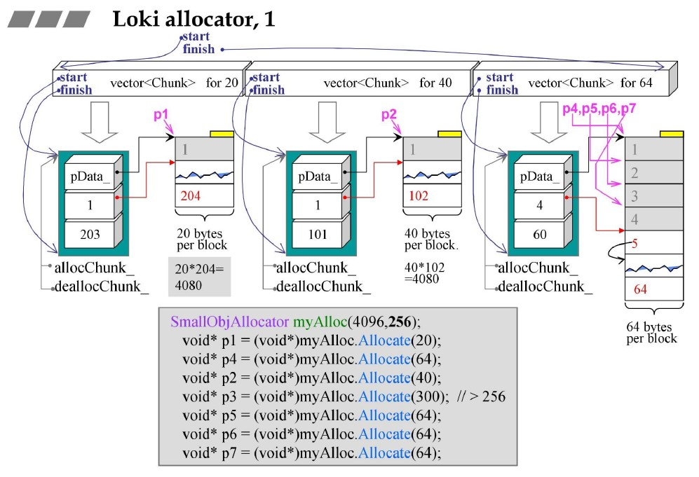
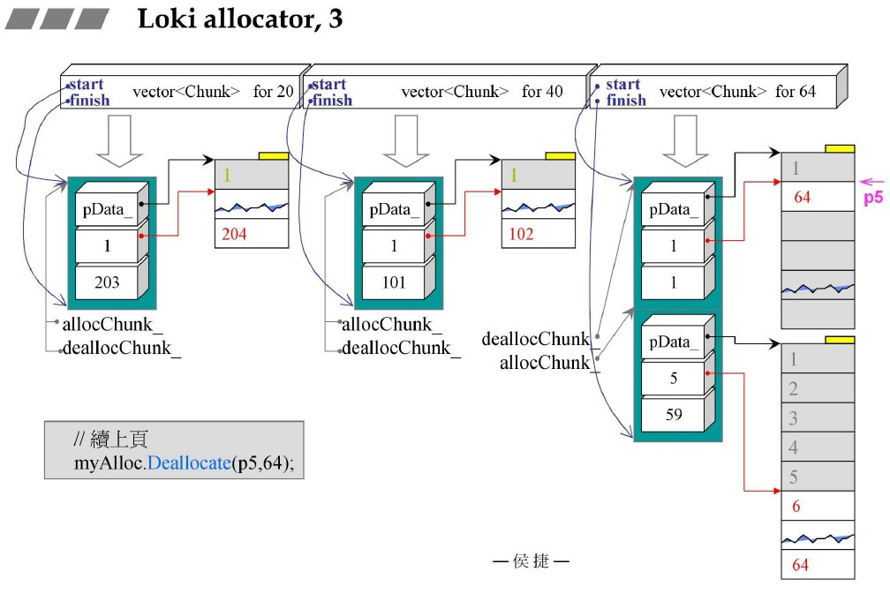
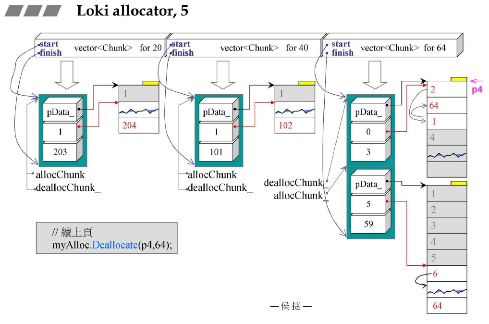
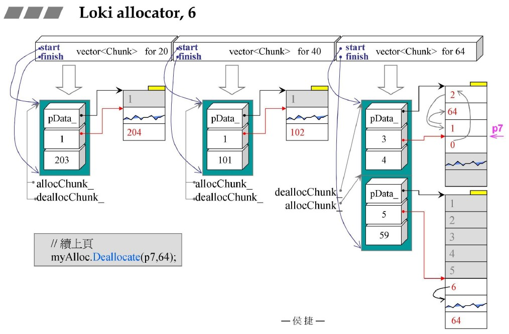

源自侯捷老师内存管理课程！

# loki allocator

## 3 classes

3层结构，由下至上：Chunk、FixedAllocator、SmallObjAllocator

1. Chunk：最下层具体存储结构，第一个指针直向全体空间，第二个为第一个待分配空间下标index，第三个为已分配空间数量。
2. FixedAllocator：中间管理层，Chunk数组，两个Chunk指针。
3. SmallObjAllocator：最高层，FixedChunk数组，两个FixedChunk指针，chunk大小，最大对象大小。

## loki alloc

## chunk alloc

采用类似embedded pointer思想，将第一个byte用作index，具体分配出去之后可以被覆盖！

分配块流程：根据chunk第二个参数即第一个待分配的空间下标index进行分配，将待分配空间中的第一个位置拿出来替换chunk第二个参数index，可用块数--。

回收块流程：根据chunk指针与已分配空间块数和每块大小，可以判断指针是否属于该chunk。（穷举遍历：并不消耗过多时间）头插法，将当前块第一个byte改为chunk中第二个index值，将chunk中index值修改为回收块下标，可用块数++。
