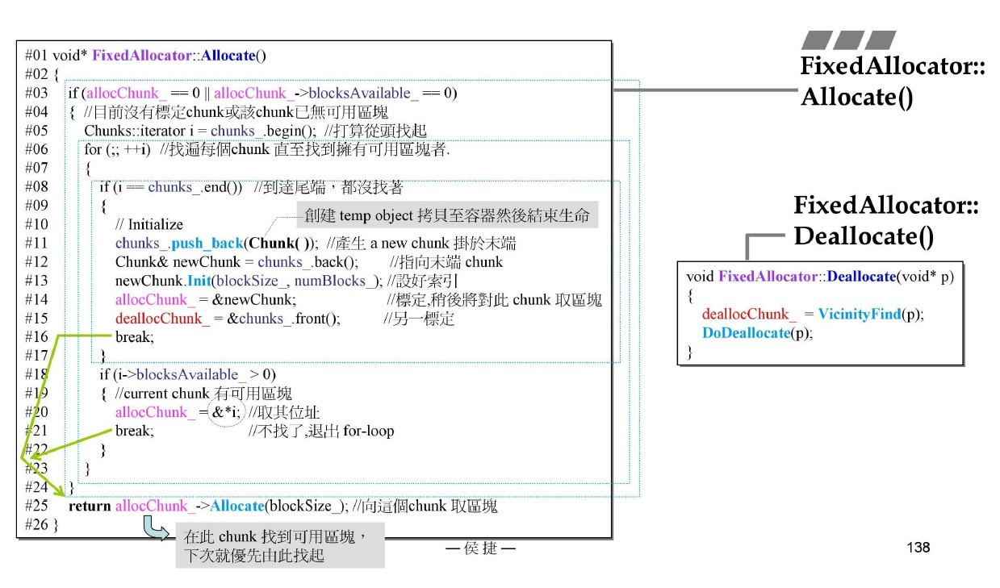

源自侯捷老师内存管理课程！

# loki allocator

## FixedAllocator

### allocate

分配流程：

1. 寻找哪个块还有空间：
   
    1.1 如果没有空间，需要申请新块;

    1.2 有空间，取空间对应chunk。
2. 找到对应的chunk，调用chunk的allocate。

- 为什么要操作deallocChunk指针？明明分配空间没有影响！

    有影响！注意使用的是vector，有可能会有内存移动！！！

- 为什么要写&*i，&*操作不是可以抵消吗？

    因为i是iterator，不是指针pointer！！！

- 未解决：有空间，可能chunk中的块大小不满足，怎么办？

### deallocate

回收流程：

1. 找到对应位置，删除：
   
    1.1 经典方法：根据指针加空间大小判断是否在该区间内；

    1.2 不使用遍历，使用逼近检测，由dealloc出发向两头寻找。

2. 执行对应的删除操作，需要判断是否全回收：

    2.1 当前是最后一个chunk，如果前一个chunk也为空，回收当前chunk及最后一个；

    2.2 当前不是最后一个chunk，并且最后一个chunk也为空，回收最后一个；

    2.3 当前不是最后一个chunk，并且不是全回收，将当前chunk置换到vector最后，回收。

- 未考虑回收不在管理的空间怎么办？

    lo与hi同时碰到边界，直接返回不存在！

- 未解决：特殊情况下不归还chunk？lo、hi边界界定？

### analyz

1. 存在bug：无法回收不是自己申请的空间、特殊情况不回收；
2. 暴力loop，改进逼近loop判断落在那个区间；
3. vector取代list；
4. 不需要cnt就可以简单通过最后一个chunk是否为空判断全回收，同时带了defer；
5. vector调用的什么allocator，由于vector比较简单，可以自己手撸一个。

