源自侯捷老师内存管理课程！

# allocator analyz

## GNC allocator

allocator诞生就是为了给容器使用，本质目的就是为了节省内存空间，去除malloc分配带来的cookie。部分allocator还是通过new/delete调用malloc/free。

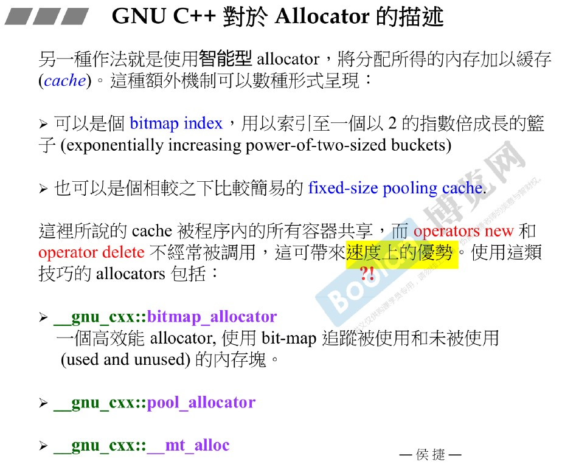

智能型allocator，就是使用缓存思想构建内存池，供所有容器共享（应该是使用该分配器的，但是内存池不是容器构建的吗？全局静态allocator，大家共享！）。

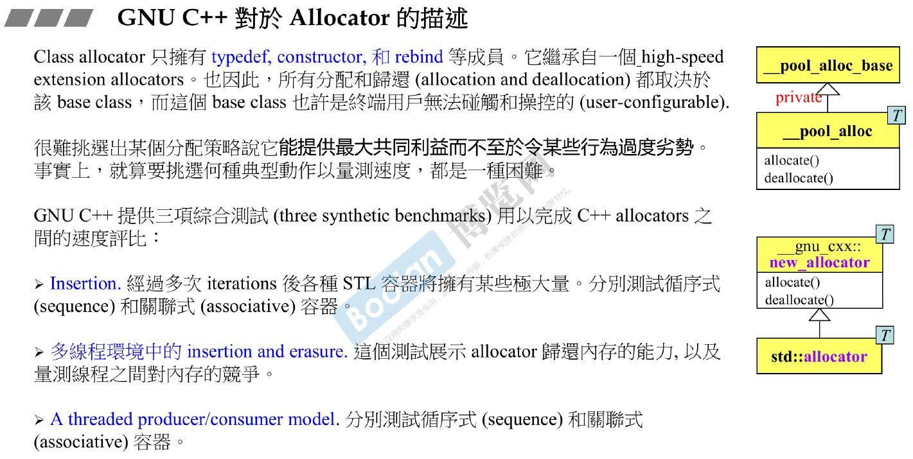

GNC提供了三个评价allocator的性能指标：插入性能、多线程插入删除、单线程生产者消费者模型性能。

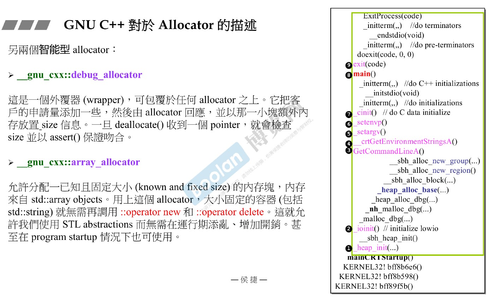

另外的allocator：
1. debug_allocator：为调用malloc/delete做一层封装;
2. array_allocator：对已有数组封装。

## vs2013 allocator

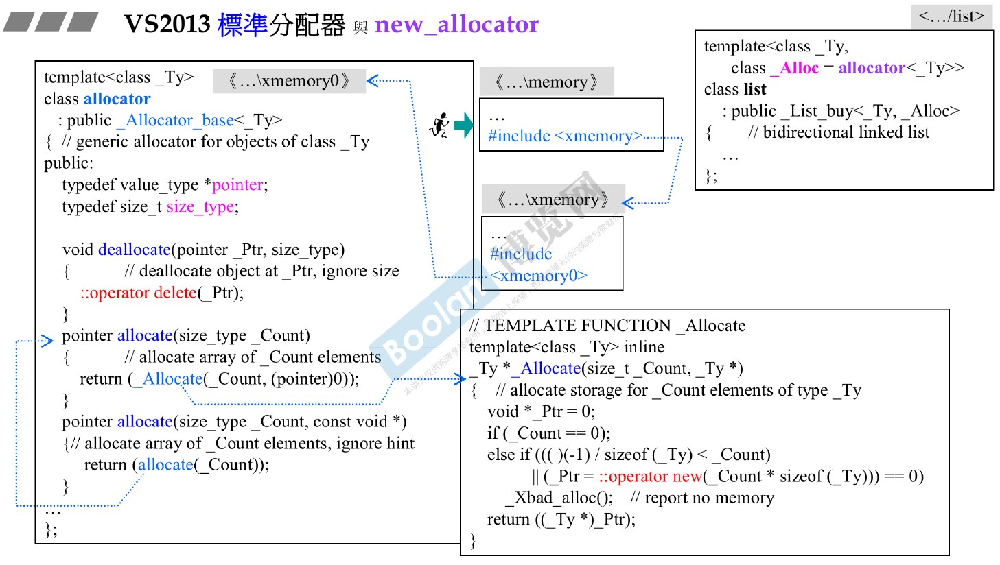

直接调用new/delete。

## GN4.9 allocator

### std_allocator

直接调用new/delete。

### malloc allocator

直接调用malloc/free。

### malloc array allocator

对数组进行封装，故不需要deallocate，allocate只是对已有空间分配及操作大小移动。

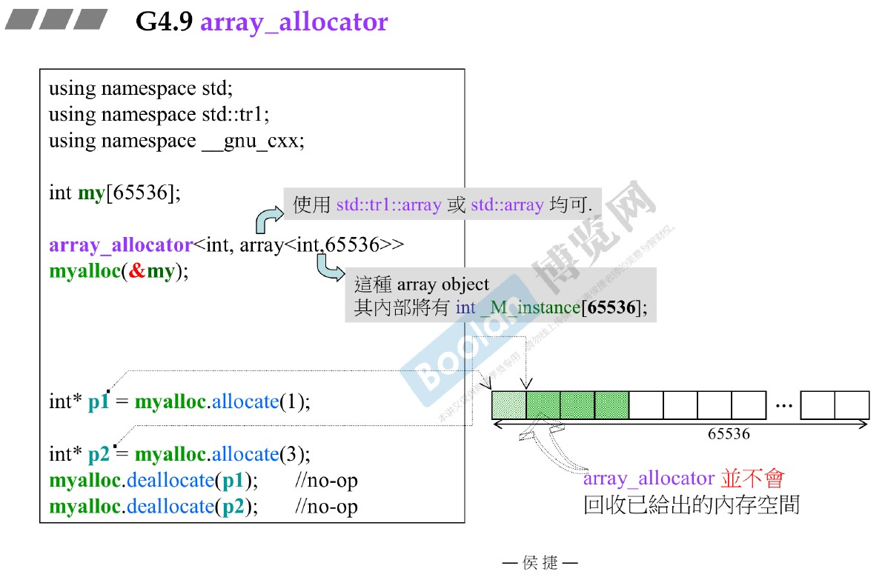

### debug allocator

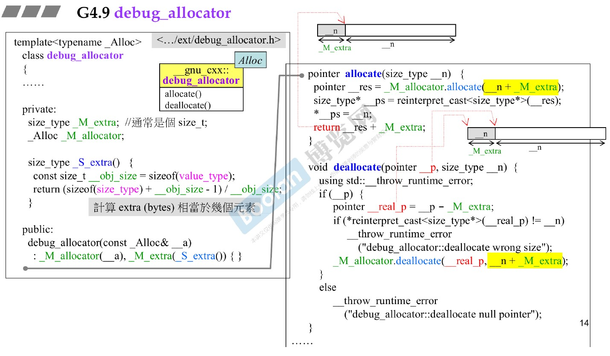

模仿malloc中的debugheader加了一个大小模块，同时又采用结构体对齐思想。

### GN2.9 std_alloc

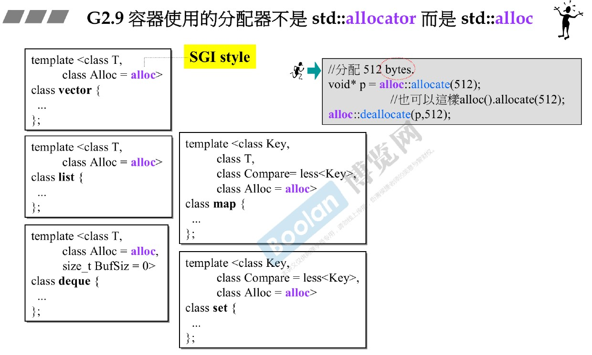

### pool_alloc

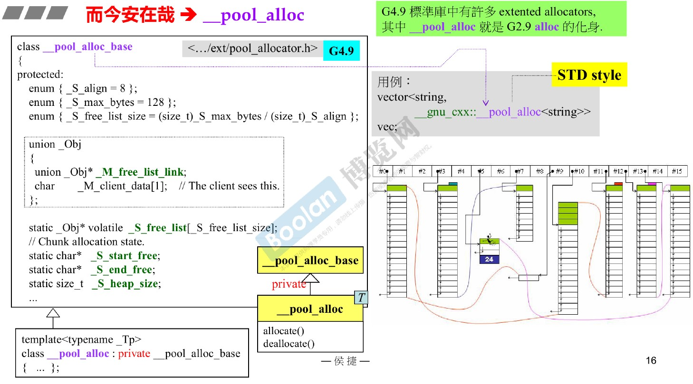

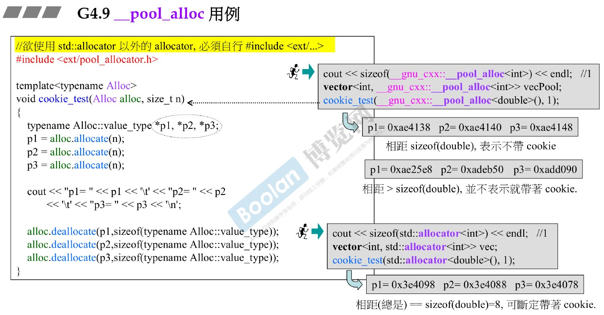

### bitmap allocator

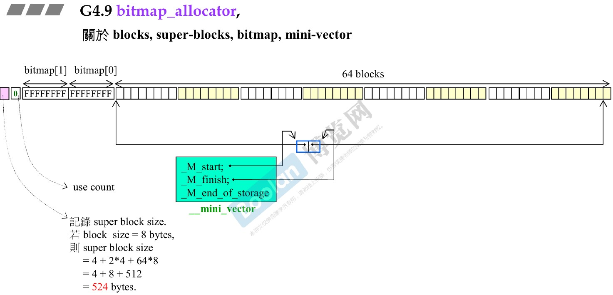

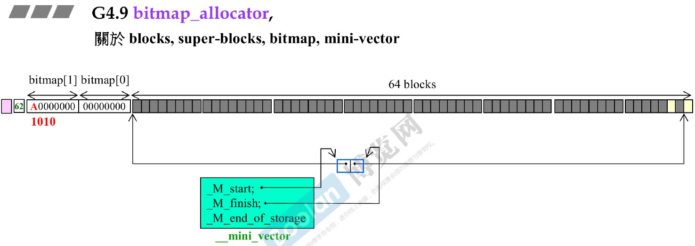

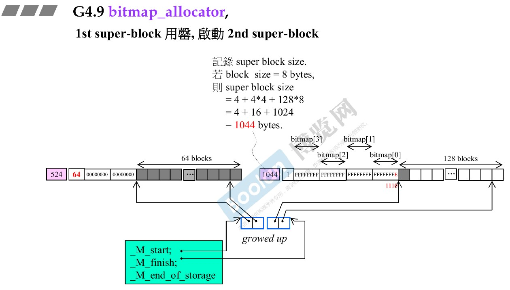

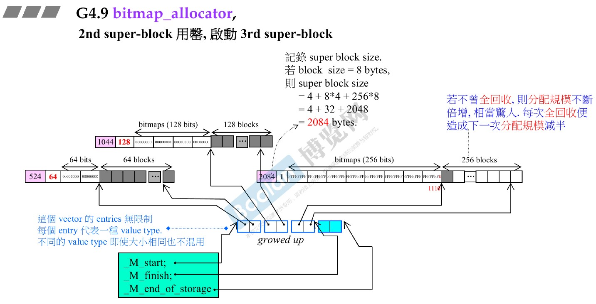

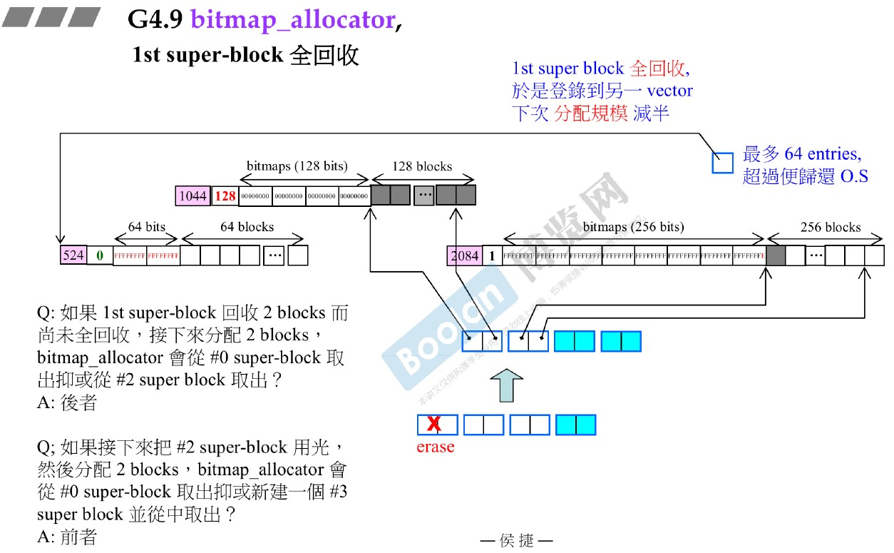

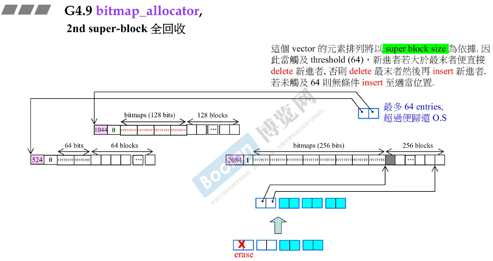

### use case

