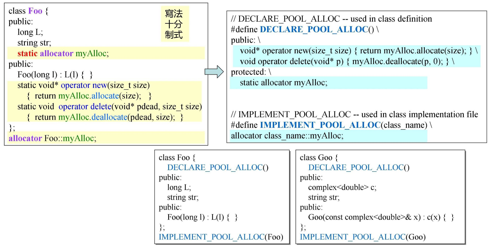
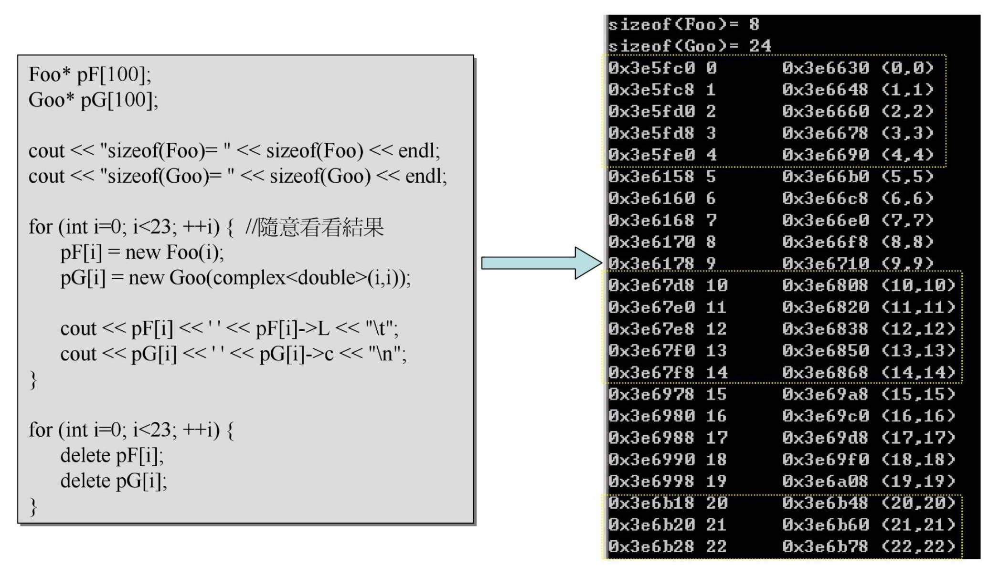

源自侯捷老师内存管理课程！

# allocator

人类追求的本质是简化操作，在追求懒得路上一路狂奔，这就是代码重用的意义。(●'◡'●)

## static allocator

观察前面的class allocator发现，内存分配操作相同，可以抽取出来实现代码重用。

## macro allocator

观察static allocator发现，class内部对于其使用也是重复过程，可以进一步抽取代码实现复用。

## global allocator

直接开辟一个固定大小的allocator专门来做内存分配，内存池思想，std::allocator雏形。

