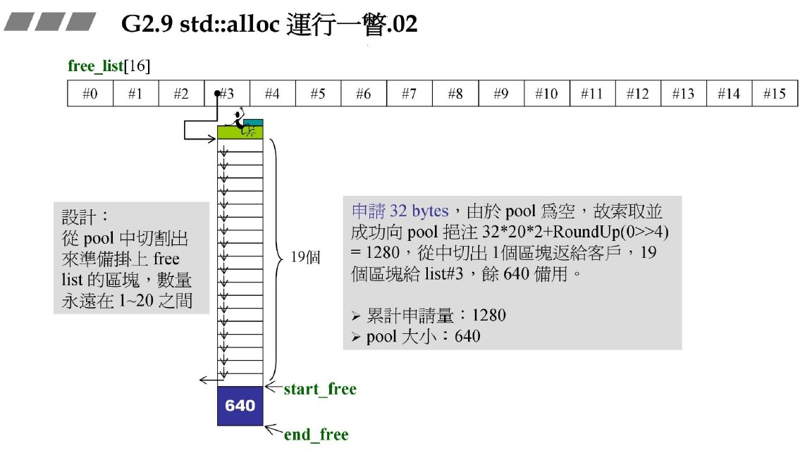
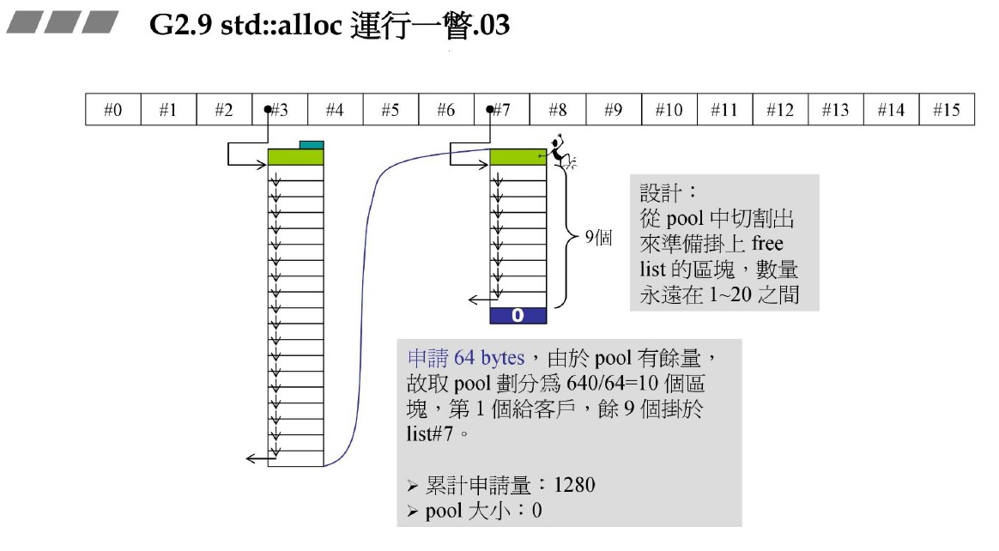
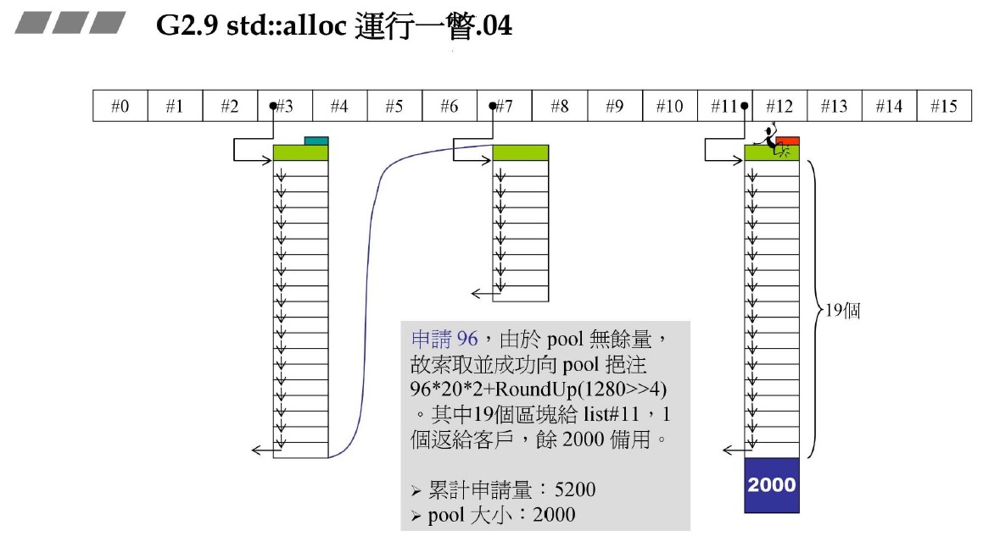
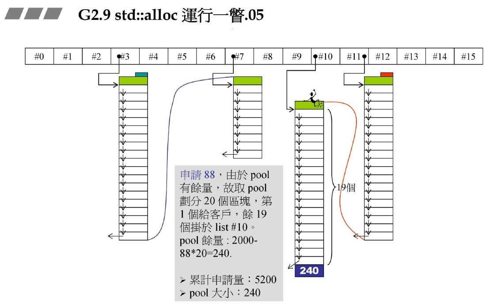
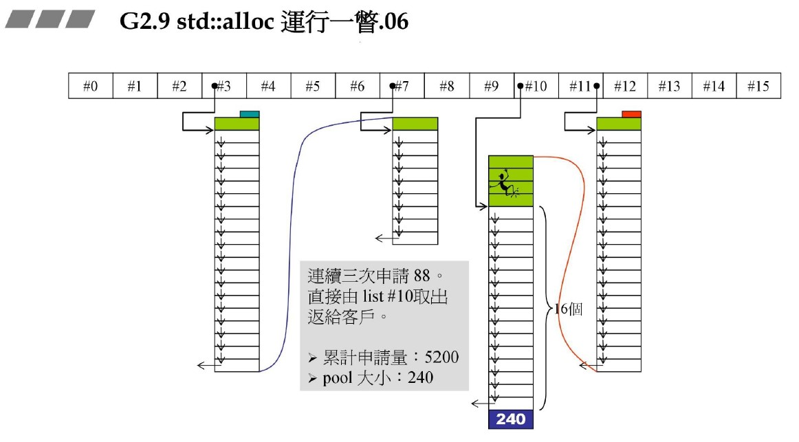
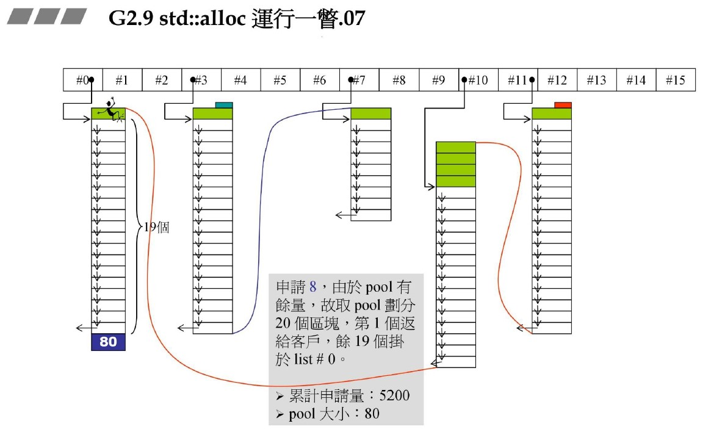
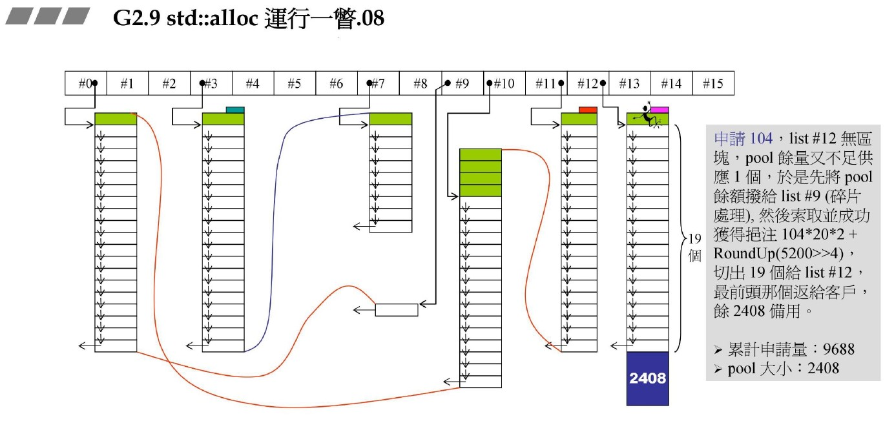
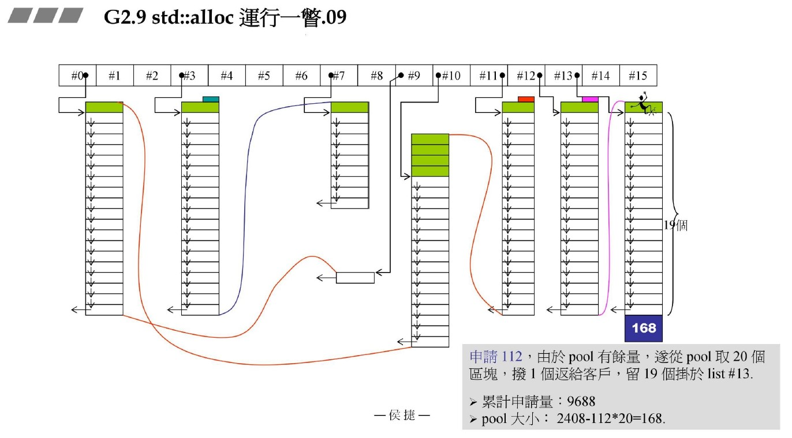
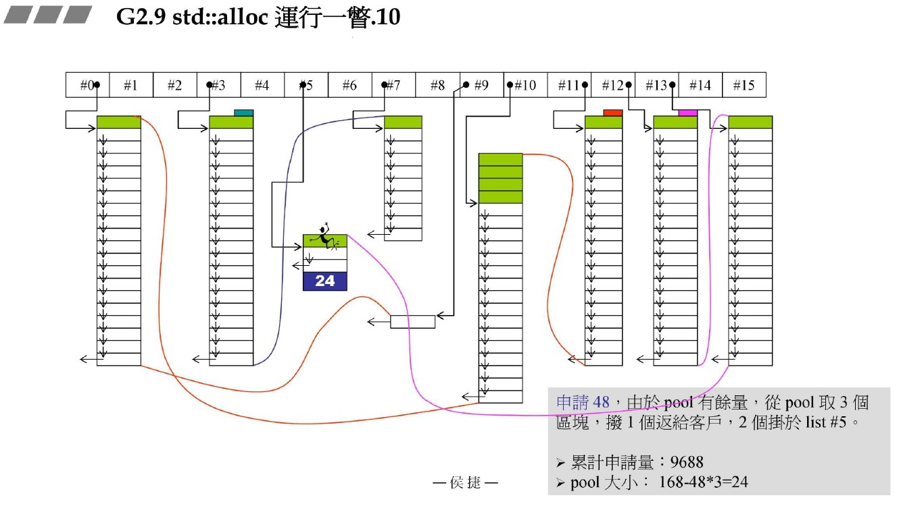
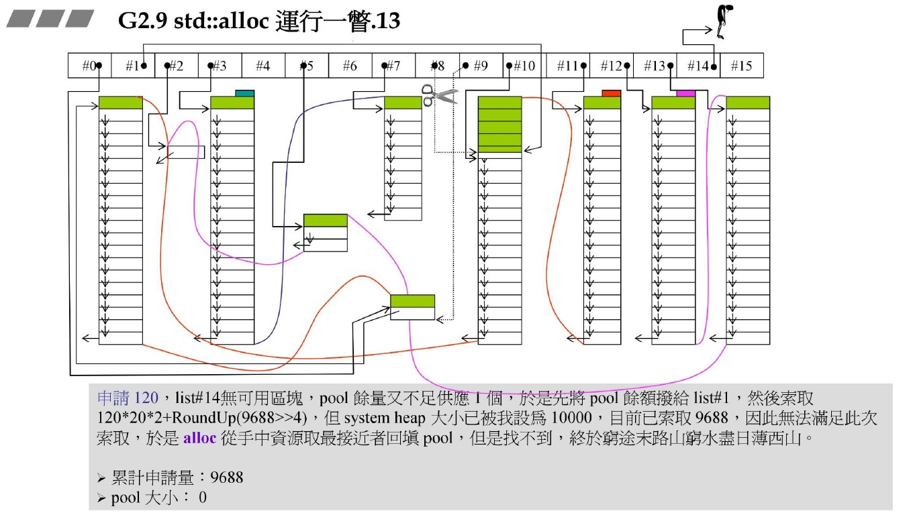

源自侯捷老师内存管理课程！

# GN2.9 std::alloc

## 运行机制

std::alloc由16个指针组成，共同构成一个内存池。

从0-15的指针分别对应8B-8*16B的基本块大小！

- 分配流程（无限内存）

1. 申请空间，自动对齐至8字节；
2. 查看对应指针有无空间：

  2.1 没有，查看是否有申请空间未使用：
      
    2.1.1 若有，检查未使用空间是否足够分配：
        
      2.1.1.1 空间可以进行分配，则尽最大可能分配，分配规则为1-20个对应块大小；

      2.1.1.2 空间不足，则将当前空间分配给合适的指针块，再去做空间申请。
      
    2.1.2 若没有，则申请空间。申请规则：申请20个该块大小，同时再申请一份20个块大小做占备池，还要申请已申请空间除16对齐至16倍数的追加量。

  2.2 有，则检查是否有剩余块：
    
    2.2.1 有，直接分配；

    2.2.2 没有，进行2.1步骤。

正常内存是有限的，申请空间时要做判断，不满足不申请。

- 问题：

1. 申请不了空间，何解？

  借用更大一级的未使用块进行切割，会增加未分配块！

2. 无法借用，何解？

  2.1 内存调整，将申请未分配的块重新分配？

    代价太高！

  2.2 调整申请规则，不一定要申请20个、同时留足战备池和追加量三个条件都满足，尽最大可能申请。

## 优秀的设计思想

1. 20块一充值
2. 20块占备池
3. 追加量
4. 碎片处理

就我而言，这些设计精妙之处在于，巧妙利用了8B为单位大小，进行分块，结合上述手段，完美解决了碎片问题。
